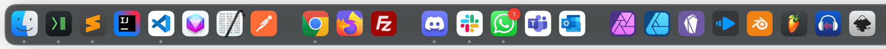
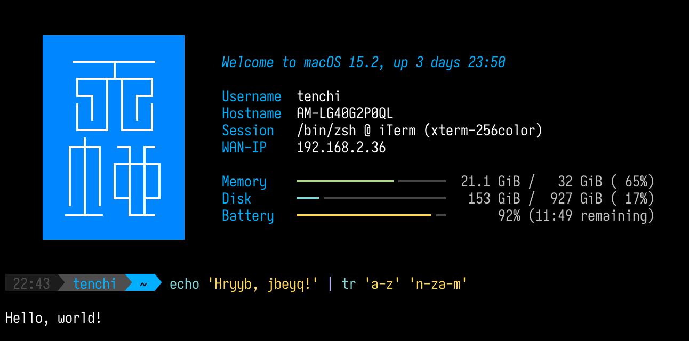

# Tenchi's dotfiles

Very customized macOS setup for Macbooks.

## Features:

- Automatic installation of a host of applications and tools
- Pre-configure most macOS settings with more sensible defaults
- Managed Dock and icons:

    
    - Apps are automatically added to the dock and grouped by categories
    - Custom icons are patched into apps that ship with ugly default icons

- Custom prompt and CLI themes:

    

    - Animated intro
    - Custom syntax highlighting
    - Custom colors for `ls`, `tree`, `grep`, `man`, `git`, `tldr`

- Pre-configured tools:
    - iTerm2: quake console style global shortcut: <kbd>⌘ + `</kbd>, custom font and theme
    - Sublime Text: theme, settings, packages
    - SSH private key and other environment variables using password manager

- Fixes missing macOS features:
    - Hide menu bar icons ([Hidden Bar](https://github.com/dwarvesf/hidden))
    - Window tiling manager ([Rectangle](https://rectangleapp.com/))
    - Resolution switcher ([SwitchResX](https://www.madrau.com/), paid)
    - Prevent sleep ([KeepingYouAwake](https://keepingyouawake.app/))
    - Hide notch ([TopNotch](https://topnotch.app/))
    - Mouse acceleration fix ([Linear Mouse](https://linearmouse.app/))

## Install

On a new computer:

- First, install Brew and the two top-level dependencies:

    ```bash
    /bin/bash -c "$(curl -fsSL https://raw.githubusercontent.com/Homebrew/install/HEAD/install.sh)"
    brew install chezmoi bitwarden-cli
    ```

- Then, log in and unlock the Bitwarden vault, then copy paste the `export` command:

    ```bash
    bw login
    bw unlock
    ```

- Finally, run `chezmoi`:

    ```bash
    chezmoi init --apply Tenchi2xh
    ```

## TODO

- Visual Studio Code pre-configuration for theme, settings, extensions
